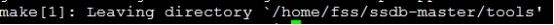

# ssdb安装和配置

## 官网

http://ssdb.io/zh_cn/

[https://github.com/ideawu/ssdb-docs/blob/master/pdf/SSDB%E5%85%A5%E9%97%A8%E5%9F%BA%E7%A1%80.pdf](https://github.com/ideawu/ssdb-docs/blob/master/pdf/SSDB入门基础.pdf)

https://github.com/LazyZhu/lua-resty-ssdb

http://www.ideawu.net/blog/ssdb

## 安装

### 安装准备

yum -y install autoconf

yum install gcc-c++ 

### 开始安装

useradd ssdb

passwd ssdb

su - ssdb

wget --no-check-certificate https://github.com/ideawu/ssdb/archive/master.zip

unzip master

cd ssdb-master

\# 安装到自定义目录

make  # 编译

make install PREFIX=/home/ssdb/ssdb # 安装

 

## 命令

### 启动

~/ssdb/ssdb-server -d ~/ssdb/ssdb.conf

### 停止

~/ssdb/ssdb-server  -s stop ~/ssdb/ssdb.conf

### 重启

~/ssdb/ssdb-server -d -s restart ~/ssdb/ssdb.conf

##  配置

mkdir ~/ssdbdata

vi ~/ssdb/ssdb.conf

work_dir = /home/ssdb/ssdbdata # 设置工作目录,ssdb第一次启动会生成data和meta目录，这个目录应该挂载一个快盘，最好是固定硬盘。

pidfile = ./ssdb.pid  # ssdb进程文件pid

 logger:

​    level: warn  # 生产环境应该设置日志级别为warn，默认debug会产生大量的日志。

其它配置见官方文档：http://ssdb.io/docs/zh_cn/config.html

 

auth: 密码，必须是32位密码，否则无法启动

 

## 可靠性

 

ssdb受限于存储引擎leveldb(google开发)， leveldb 更新前先写日志方式，但默认方式日志mmap是不会做msync，也就是完全依赖操作系统刷磁盘，这样存在机器掉电等意外故障时可能会丢失部分最新消息。

http://www.ideawu.net/blog/archives/700.html

 